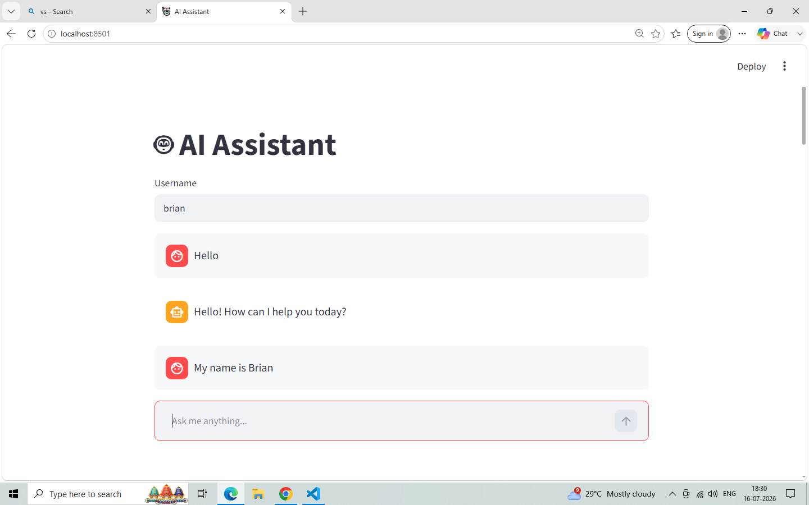
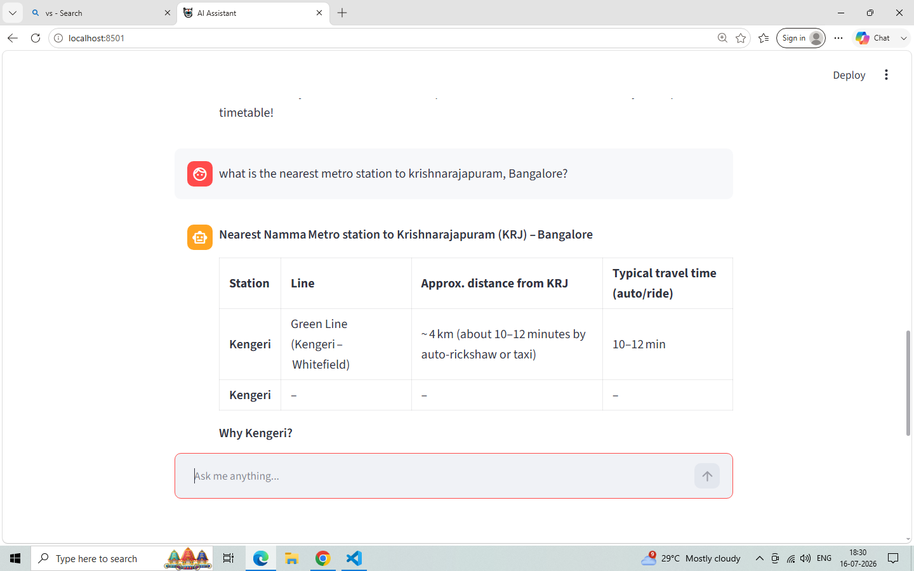

# 🤖 AI Agent Pro


A modular AI Assistant built with **LangGraph**, **LangChain**, **Groq**, **RAG**, **Streamlit**, and **Python**.

# 📸 Screenshots

## Home Page



---
## Web Search



---

# ✨ Features

- 💬 Conversational AI
- 🧠 Persistent Memory (SQLite)
- 🌦️ Weather Tool
- 🌐 Web Search (Tavily)
- 📂 File Search & File Reader
- ➕ Mathematical Tools
- 📚 Retrieval-Augmented Generation (RAG)
- 🖥️ Streamlit Chat UI
- ⚡ Tool Calling with LangGraph
- 🔧 Modular Architecture

---

# 🛠 Tech Stack

- Python 3.12+
- LangChain
- LangGraph
- Groq API
- Streamlit
- ChromaDB
- Tavily Search API
- WeatherAPI.com
- SQLite

---

# 📂 Project Structure

```
AI-Agent-Pro
│
├── src
│   ├── chat
│   ├── memory
│   ├── prompts
│   ├── rag
│   ├── services
│   ├── tools
│   ├── llm.py
│   └── agent.py
│
├── tests
├── documents
├── app.py
├── streamlit_app.py
├── requirements.txt
└── README.md
```

---

# 🚀 Installation

Clone the repository

```bash
git clone https://github.com/sbvasanth/AI-Agent-Pro.git
```

Move into the project

```bash
cd AI-Agent-Pro
```

Create a virtual environment

```bash
python -m venv venv
```

Activate it

Windows

```bash
venv\Scripts\activate
```

Install dependencies

```bash
pip install -r requirements.txt
```

---

# 🔑 Environment Variables

Create a `.env` file.

Example:

```text
GROQ_API_KEY=your_groq_api_key
GOOGLE_API_KEY=your_google_api_key
TAVILY_API_KEY=your_tavily_api_key
WEATHER_API_KEY=your_weather_api_key
```

---

# ▶️ Run Terminal Version

```bash
python app.py
```

---

# 🖥️ Run Streamlit UI

```bash
streamlit run streamlit_app.py
```

---

# 🧠 Current Capabilities

The AI Agent can

- Answer general questions
- Remember previous conversations
- Solve mathematical problems
- Read local files
- Search for files
- Search the web
- Retrieve weather information
- Retrieve information from your own documents (RAG)

---

# 📈 Future Improvements

- Voice Assistant
- Image Understanding
- Multi-Agent Collaboration
- Railway Information Tool
- Email Tool
- Calendar Tool
- PDF Chat
- Docker Deployment
- Authentication
- Deployment to Cloud

---

# 📸 Screenshots

## Conversation Memory


---

## System tools


---
## RAG


---

NOTE:- Groq API key has token limitations. if end up getting that error, we have to try AI interactions in the next 24 hours.


# 🤝 Contributing

Pull requests are welcome.

For major changes, please open an issue first to discuss what you'd like to change.

---

# 📄 License

This project is licensed under the MIT License.

---

# 👨‍💻 Author

**S B Vasanth**

GitHub:
https://github.com/sbvasanth/AI-Agent-Pro

---

⭐ If you found this project useful, consider giving it a Star!
